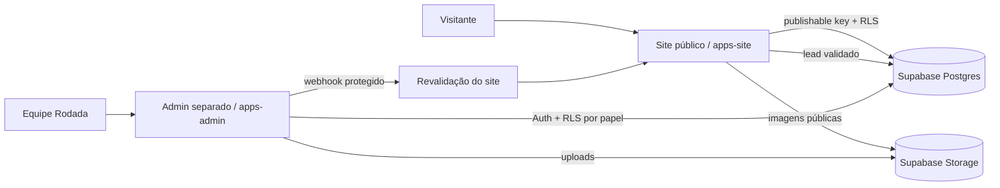

# Cervejaria Rodada — Plataforma

Evolução do site da Cervejaria Rodada para uma plataforma com site público, painel administrativo separado e Supabase.

## Estado da migração

A produção atual continua usando a aplicação Next.js na raiz do repositório para não interromper o deploy existente. A nova estrutura de workspace já separa o admin e prepara o destino `apps/site`. O corte físico do site para `apps/site` deve acontecer junto com a criação do novo projeto Vercel do site.

## Arquitetura



## Stack atual encontrada

- Next.js 16.3.8
- React 19.3
- TypeScript 7
- Framer Motion
- Site atual em App Router, com interface principal concentrada em `components/rodada-site.tsx`
- Imagens locais em `public/`, mas ainda existem dependências externas legadas do Wix
- GitHub Actions existente

## Estrutura alvo

- `apps/site`: site público (destino após cutover)
- `apps/admin`: painel administrativo independente
- `packages/db`: schema/seed/tipos do Supabase
- `skills/`: padrões operacionais reutilizáveis
- `AGENTS.md`: regras para agentes e contribuidores
- `PENDENCIAS.md`: dados que dependem da Cervejaria Rodada

## Banco

`packages/db/schema.sql` é o schema canônico de revisão. Ele contém tabelas, índices, grants e RLS. Depois de criar o projeto Supabase e instalar/configurar a CLI, gere a migration oficial com:

```bash
supabase migration new initial_schema
```

Copie o SQL revisado para o arquivo gerado, aplique em desenvolvimento, rode os advisors/testes e somente depois promova para produção. Não invente nome de arquivo de migration manualmente.

O seed em `packages/db/seed.sql` usa somente dados já presentes no site; campos desconhecidos ficam NULL e os produtos entram despublicados.

## Segurança

- RLS habilitado em todas as tabelas do domínio.
- `anon` lê somente conteúdo publicado/aprovado e pode inserir lead validado.
- Papéis do admin: `owner`, `editor`, `viewer`.
- Secret/service key nunca deve ir para o cliente.
- Admin bloqueado para indexação e com headers de hardening.
- MFA do owner deve ser exigido na configuração do Auth.

## Como rodar agora

O site legado continua:

```bash
npm install
npm run dev
```

Para a nova estrutura, após instalar pnpm e concluir a migração física do site:

```bash
pnpm install
pnpm dev:admin
```

## Deploy Vercel

Crie dois projetos separados apontando para o mesmo repositório:

1. **Site público** — durante a transição, root do repositório; no cutover, mudar Root Directory para `apps/site`.
2. **Admin** — Root Directory `apps/admin`.

Domínios alvo:
- `www.cervejariarodada.com.br`
- `admin.cervejariarodada.com.br`

Não faça o cutover do site antes de copiar os assets para `apps/site/public`, validar build e smoke test.

## Supabase

Criar projetos separados de desenvolvimento e produção. Configurar explicitamente acesso à Data API, grants e RLS; projetos novos não devem depender de autoexposição de tabelas.

Buckets planejados:
- público: imagens já aprovadas/publicadas
- privado: originais

Uploads do admin devem validar tipo/tamanho, exigir alt e gerar versões otimizadas antes da publicação.

## Primeiro owner

1. Criar usuário manualmente no Supabase Auth.
2. Inserir o `user_id` correspondente em `admin_profiles` com papel `owner`.
3. Habilitar MFA/TOTP e exigir a política no fluxo do admin.
4. Não disponibilizar cadastro público.

## Manual: o que ainda depende de você

1. Criar os projetos Supabase dev/prod.
2. Configurar as variáveis de `apps/site/.env.example` e `apps/admin/.env.example`.
3. Criar os dois projetos Vercel e domínios.
4. Criar o primeiro owner + MFA.
5. Fornecer os dados/fotos listados em `PENDENCIAS.md`.
6. Só então migrar o site físico para `apps/site` e ligar leitura do banco.

## Critério de qualidade

Nunca registrar como aprovado algo que não tenha sido executado. Build, testes, E2E, Lighthouse, segurança e acessibilidade precisam de resultado real antes de release.


## Admin — fatia 1: autenticação e permissões

Implementado na branch `feat/admin`:

- autenticação por e-mail/senha via Supabase Auth;
- sessão protegida no servidor com `proxy.ts` do Next.js 16;
- cookies de autenticação reforçados com `HttpOnly`, `Secure` em produção, `SameSite=Lax` e `Path=/`;
- papéis `owner`, `editor` e `viewer`, com autorização validada no servidor;
- owner obrigado a concluir MFA/TOTP antes de acessar o painel;
- recuperação de senha por e-mail e definição de nova senha;
- logout global;
- bloqueio de login após 5 falhas em 15 minutos por combinação anonimizada de e-mail/IP;
- convites sem cadastro público;
- tela de usuários exclusiva para owner, com troca de papel e desativação;
- auditoria de login, logout, convite, alteração de papel e desativação;
- RLS ajustado para viewer ler, editor editar conteúdo e owner administrar usuários;
- `noindex/nofollow` no admin.

As mutações usam Server Actions. O Next.js valida a origem das Server Actions contra o Host por padrão; não foram adicionadas origens cross-site extras.

### Variáveis do projeto Vercel do admin

No projeto Vercel cuja **Root Directory é `apps/admin`**, configure:

```text
NEXT_PUBLIC_SUPABASE_URL=...
NEXT_PUBLIC_SUPABASE_PUBLISHABLE_KEY=...
SUPABASE_SECRET_KEY=...
ADMIN_APP_URL=https://admin.cervejariarodada.com.br
SITE_REVALIDATE_URL=...
REVALIDATE_SECRET=...
```

`SUPABASE_SECRET_KEY` é segredo exclusivamente server-side. Não configure essa chave no projeto Vercel do site público e não use prefixo `NEXT_PUBLIC_`.

### Aplicar o schema no Supabase da Rodada

O arquivo `packages/db/schema.sql` contém as estruturas exigidas por esta fatia, incluindo `admin_profiles.active` e `admin_login_attempts`. Aplique **somente no projeto Supabase da Cervejaria Rodada**.

Para um projeto novo, revise e execute o schema canônico no SQL Editor ou converta-o em migration via Supabase CLI antes do deploy.

### Criar o primeiro owner sem senha no código

1. No Supabase da Rodada, abra **Authentication → Users → Add user**.
2. Crie o usuário owner manualmente e defina a senha diretamente no Supabase.
3. Copie o UUID desse usuário.
4. No SQL Editor do mesmo projeto, execute substituindo apenas o UUID e o nome:

```sql
insert into public.admin_profiles (user_id, role, display_name, active)
values ('UUID_DO_USUARIO', 'owner', 'Nome do owner', true)
on conflict (user_id) do update
set role='owner', display_name=excluded.display_name, active=true;
```

5. Em **Authentication → URL Configuration**, adicione `https://admin.cervejariarodada.com.br/auth/callback` às Redirect URLs.
6. Entre no admin. O fluxo exigirá o cadastro do TOTP antes de liberar o dashboard.

### Configuração recomendada do Supabase Auth

No projeto da Rodada:

- desative qualquer cadastro público pela aplicação;
- mantenha e-mail/senha habilitado;
- configure SMTP para convites e recuperação de senha em produção;
- defina expiração de JWT/sessão conforme a política da empresa;
- mantenha TOTP habilitado.

### Como testar a fatia 1

1. **Owner + MFA:** crie o owner como acima, entre com e-mail/senha, escaneie o QR TOTP e confirme o código. O dashboard deve abrir apenas após AAL2.
2. **Editor convidado:** como owner, abra `/users`, convide um editor, abra o link recebido, defina a senha e entre. O editor não deve acessar `/users`.
3. **Viewer:** convide um viewer e confirme que consegue autenticar, mas não recebe permissão de edição pelas políticas do banco.
4. **Logout:** clique em Sair e tente abrir `/` novamente; deve redirecionar para `/login`.
5. **Proteção direta:** sem sessão, abra `/users`; deve redirecionar para login. Logado como editor/viewer, `/users` deve bloquear no servidor.
6. **Recuperação:** use `/recover`, abra o e-mail recebido e defina uma senha nova.
7. **Força bruta:** após 5 falhas em 15 minutos para a mesma combinação de e-mail/IP, o login deve responder com bloqueio temporário.

A integração real com Auth, envio de e-mail e RLS só pode ser validada depois que as variáveis e o schema forem aplicados no Supabase da Rodada.
