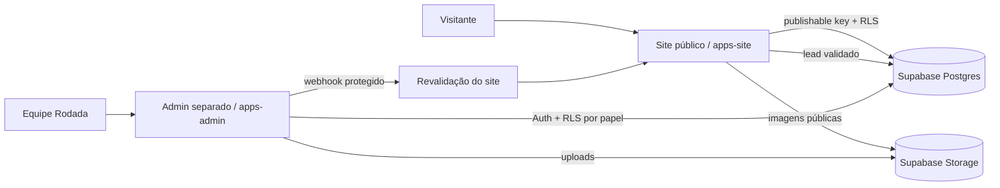

# Cervejaria Rodada — Plataforma

Evolução do site da Cervejaria Rodada para uma plataforma com site público, painel administrativo separado e Supabase.

## Estado da migração

A produção atual continua usando a aplicação Next.js na raiz do repositório para não interromper o deploy existente. A nova estrutura de workspace já separa o admin e prepara o destino `apps/site`. O corte físico do site para `apps/site` deve acontecer junto com a criação do novo projeto Vercel do site.

## Arquitetura



## Stack atual encontrada

- Next.js 16.3.8
- React 19.3
- TypeScript 7
- Framer Motion
- Site atual em App Router, com interface principal concentrada em `components/rodada-site.tsx`
- Imagens locais em `public/`, mas ainda existem dependências externas legadas do Wix
- GitHub Actions existente

## Estrutura alvo

- `apps/site`: site público (destino após cutover)
- `apps/admin`: painel administrativo independente
- `packages/db`: schema/seed/tipos do Supabase
- `skills/`: padrões operacionais reutilizáveis
- `AGENTS.md`: regras para agentes e contribuidores
- `PENDENCIAS.md`: dados que dependem da Cervejaria Rodada

## Banco

`packages/db/schema.sql` é o schema canônico de revisão. Ele contém tabelas, índices, grants e RLS. Depois de criar o projeto Supabase e instalar/configurar a CLI, gere a migration oficial com:

```bash
supabase migration new initial_schema
```

Copie o SQL revisado para o arquivo gerado, aplique em desenvolvimento, rode os advisors/testes e somente depois promova para produção. Não invente nome de arquivo de migration manualmente.

O seed em `packages/db/seed.sql` usa somente dados já presentes no site; campos desconhecidos ficam NULL e os produtos entram despublicados.

## Segurança

- RLS habilitado em todas as tabelas do domínio.
- `anon` lê somente conteúdo publicado/aprovado e pode inserir lead validado.
- Papéis do admin: `owner`, `editor`, `viewer`.
- Secret/service key nunca deve ir para o cliente.
- Admin bloqueado para indexação e com headers de hardening.
- MFA do owner deve ser exigido na configuração do Auth.

## Como rodar agora

O site legado continua:

```bash
npm install
npm run dev
```

Para a nova estrutura, após instalar pnpm e concluir a migração física do site:

```bash
pnpm install
pnpm dev:admin
```

## Deploy Vercel

Crie dois projetos separados apontando para o mesmo repositório:

1. **Site público** — durante a transição, root do repositório; no cutover, mudar Root Directory para `apps/site`.
2. **Admin** — Root Directory `apps/admin`.

Domínios alvo:
- `www.cervejariarodada.com.br`
- `admin.cervejariarodada.com.br`

Não faça o cutover do site antes de copiar os assets para `apps/site/public`, validar build e smoke test.

## Supabase

Criar projetos separados de desenvolvimento e produção. Configurar explicitamente acesso à Data API, grants e RLS; projetos novos não devem depender de autoexposição de tabelas.

Buckets planejados:
- público: imagens já aprovadas/publicadas
- privado: originais

Uploads do admin devem validar tipo/tamanho, exigir alt e gerar versões otimizadas antes da publicação.

## Primeiro owner

1. Criar usuário manualmente no Supabase Auth.
2. Inserir o `user_id` correspondente em `admin_profiles` com papel `owner`.
3. Habilitar MFA/TOTP e exigir a política no fluxo do admin.
4. Não disponibilizar cadastro público.

## Manual: o que ainda depende de você

1. Criar os projetos Supabase dev/prod.
2. Configurar as variáveis de `apps/site/.env.example` e `apps/admin/.env.example`.
3. Criar os dois projetos Vercel e domínios.
4. Criar o primeiro owner + MFA.
5. Fornecer os dados/fotos listados em `PENDENCIAS.md`.
6. Só então migrar o site físico para `apps/site` e ligar leitura do banco.

## Critério de qualidade

Nunca registrar como aprovado algo que não tenha sido executado. Build, testes, E2E, Lighthouse, segurança e acessibilidade precisam de resultado real antes de release.
